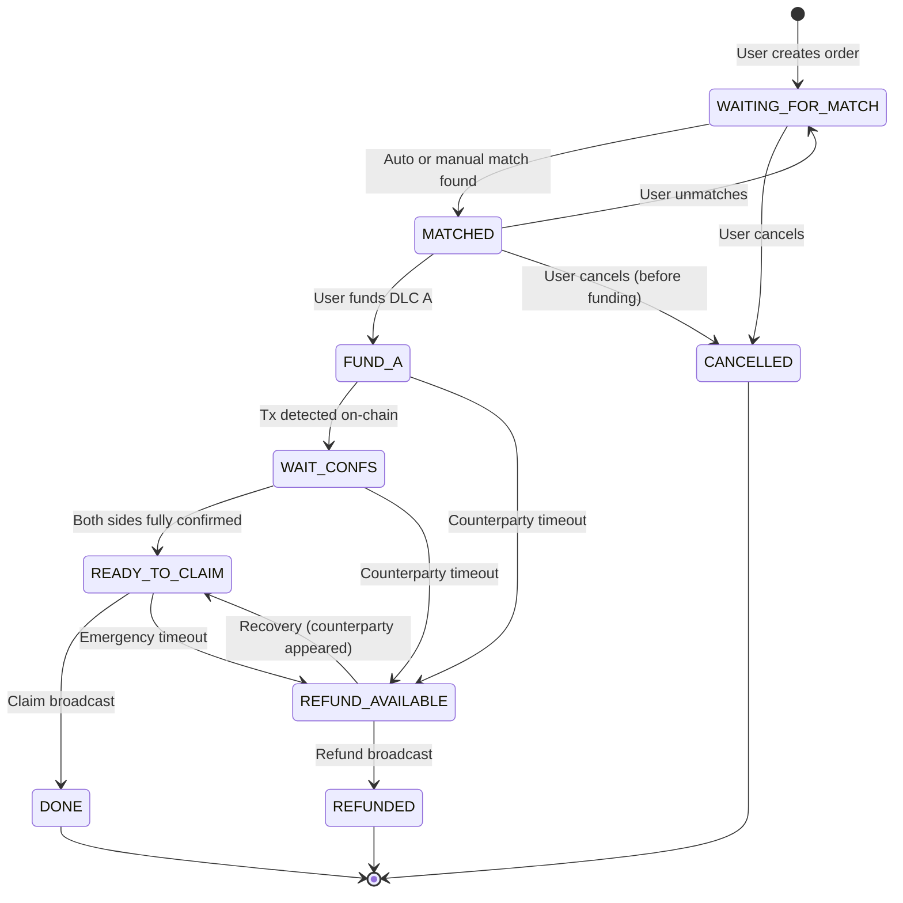

<p align="center">
  
</p>

<h1 align="center">NexumBit Protocol</h1>
<p align="center">
  <strong>Trustless P2P Atomic Swaps between Bitcoin and Fractal Bitcoin</strong><br>
  Using Discreet Log Contracts (DLCs) with Adaptor Signatures on Taproot
</p>

<table align="center" border="0" cellspacing="0" cellpadding="0">
  <tr>
    <td align="center" width="120">
      <br>
      <strong>Bitcoin</strong>
    </td>
    <td align="center" width="80">
      <code>&nbsp;⟶&nbsp;</code><br>
      <code>&nbsp;⟵&nbsp;</code>
    </td>
    <td align="center" width="120">
      <br>
      <strong>Fractal Bitcoin</strong>
    </td>
  </tr>
</table>

<p align="center">
  <code>Non-Custodial</code> · <code>Atomic</code> · <code>On-Chain Verified</code> · <code>Open Protocol</code>
</p>

---

## Table of Contents

- [Overview](#overview)
- [Architecture](#architecture)
- [Protocol Flow](#protocol-flow)
  - [State Machine](#state-machine)
  - [Happy Path — Step by Step](#happy-path--step-by-step)
  - [Sequence Diagram](#sequence-diagram)
- [On-Chain Construction](#on-chain-construction)
  - [Taproot Script Tree](#taproot-script-tree)
  - [Success Script (Claim Path)](#success-script-claim-path)
  - [Refund Script (Timeout Path)](#refund-script-timeout-path)
  - [DLC Address Derivation](#dlc-address-derivation)
  - [PSBT Construction](#psbt-construction)
- [Adaptor Signatures & Atomicity](#adaptor-signatures--atomicity)
  - [How Adaptor Secrets Work](#how-adaptor-secrets-work)
  - [Why This Is Atomic](#why-this-is-atomic)
  - [Pre-Signed Adaptor Signatures](#pre-signed-adaptor-signatures)
- [Timelock Security Model](#timelock-security-model)
  - [Why DLC A Expires Before DLC B](#why-dlc-a-expires-before-dlc-b)
  - [Attack Prevention](#attack-prevention)
  - [Confirmation Gates](#confirmation-gates)
- [Cross-Swap Data Linking](#cross-swap-data-linking)
- [Failure Scenarios & Recovery](#failure-scenarios--recovery)
- [Worked Example](#worked-example)
- [API Reference](#api-reference)
- [Configuration Parameters](#configuration-parameters)
- [BIP Compliance](#bip-compliance)
- [License](#license)

---

## Overview

NexumBit is a **fully non-custodial, peer-to-peer bridge** between **Bitcoin (BTC)** and **Fractal Bitcoin (FB)** — two architecturally identical but independent blockchains.

The protocol uses **Discreet Log Contracts (DLCs)** built on **Taproot (P2TR)** outputs with **adaptor signatures** to achieve atomic cross-chain swaps. At no point does any third party hold user funds. The NexumBit backend acts solely as a **matchmaker and PSBT builder** — all value transfer happens on-chain, verified by Bitcoin Script.

### Key Properties

| Property | Mechanism |
|---|---|
| **Non-custodial** | Funds locked in on-chain Taproot contracts; backend never holds keys |
| **Atomic** | Shared adaptor secret ensures both claims succeed or neither does |
| **Trustless** | Bitcoin Script enforces all conditions; backend is replaceable |
| **Private** | Adaptor secrets are never revealed on-chain (unlike HTLC preimages) |
| **Recoverable** | Timelock refund paths guarantee fund recovery without counterparty |

---

## Architecture

```
┌──────────────────┐                    ┌──────────────────┐
│    User A         │                    │    User B         │
│  (sends BTC)      │                    │  (sends FB)       │
│  UniSat Wallet    │                    │  UniSat Wallet    │
└────────┬─────────┘                    └────────┬─────────┘
         │                                        │
         │  HTTPS/JSON                            │  HTTPS/JSON
         ▼                                        ▼
┌─────────────────────────────────────────────────────────────┐
│                    NexumBit Backend                          │
│                                                             │
│  ┌─────────────┐  ┌──────────────┐  ┌────────────────────┐ │
│  │  Matching    │  │ DLC Builder  │  │   PSBT Builder     │ │
│  │  Service     │  │              │  │                    │ │
│  │  ──────────  │  │  ──────────  │  │  ──────────────    │ │
│  │  Pairs       │  │  Generates   │  │  Builds funding,   │ │
│  │  compatible  │  │  adaptor     │  │  claim, and refund │ │
│  │  orders by   │  │  secrets &   │  │  PSBTs with pre-   │ │
│  │  rate and    │  │  Taproot     │  │  embedded adaptor  │ │
│  │  amount      │  │  scripts     │  │  signatures        │ │
│  └─────────────┘  └──────────────┘  └────────────────────┘ │
│                                                             │
│  ┌─────────────┐  ┌──────────────┐  ┌────────────────────┐ │
│  │  Swap        │  │ Script       │  │   Taproot          │ │
│  │  Monitor     │  │ Builder      │  │   Helpers          │ │
│  │  ──────────  │  │  ──────────  │  │  ──────────────    │ │
│  │  Watches     │  │  success &   │  │  Leaf hashes,      │ │
│  │  mempool +   │  │  refund      │  │  merkle trees,     │ │
│  │  confirms    │  │  Tapscripts  │  │  tweaked keys,     │ │
│  │  for both    │  │  (BIP-342)   │  │  control blocks    │ │
│  │  chains      │  │              │  │  (BIP-341)         │ │
│  └─────────────┘  └──────────────┘  └────────────────────┘ │
└─────────────────────────────────────────────────────────────┘
         │                                        │
         ▼                                        ▼
┌──────────────────┐                    ┌──────────────────┐
│  Bitcoin Network  │                    │ Fractal Bitcoin   │
│  (BTC)            │                    │ (FB)              │
│  3 conf required  │                    │ 10 conf required  │
└──────────────────┘                    └──────────────────┘
```

---

## Protocol Flow

### State Machine

Every swap progresses through a deterministic state machine. Invalid transitions are rejected by the `SwapStateMachine` validator.



### Happy Path — Step by Step

1. **User A** posts an order: "I want to swap 0.00001010 BTC for ~1.535 FB"
2. **User B** posts an order: "I want to swap 1.535 FB for ~0.00001010 BTC"
3. **Matching Service** finds them compatible (amounts and rates within configured tolerance)
4. **Backend generates** a single shared adaptor secret `s` and public point `P = s·G`
5. **Backend builds** two DLC contracts:
   - **DLC A** on BTC: User A locks BTC; User B can claim with adaptor sig + their key
   - **DLC B** on FB: User B locks FB; User A can claim with adaptor sig + their key
6. Both users **fund their DLC A** (sign and broadcast funding transactions)
7. **Swap Monitor** watches both chains for confirmations (3 for BTC, 10 for FB)
8. Once **both sides are confirmed**, state transitions to `READY_TO_CLAIM`
9. **User A claims** DLC B (FB) using a pre-signed adaptor signature + their own key
10. **User B claims** DLC A (BTC) using a pre-signed adaptor signature + their own key
11. Both swaps marked `DONE`

### Sequence Diagram

```mermaid
sequenceDiagram
    participant A as 👤 User A (BTC → FB)
    participant BE as 🖥️ NexumBit Backend
    participant B as 👤 User B (FB → BTC)
    participant BTC as ₿ Bitcoin Chain
    participant FB as 🔷 Fractal Chain

    Note over A,B: 1. Order Creation
    A->>BE: POST /swap/create (BTC→FB, auto_match=true)
    Note over BE: State: WAITING_FOR_MATCH
    B->>BE: POST /swap/create (FB→BTC, auto_match=true)

    Note over BE: 2. Matching & DLC Generation
    Note over BE: Generate shared adaptor_secret (s)
    Note over BE: adaptor_point P = s·G
    Note over BE: Build DLC A (BTC) & DLC B (FB)
    Note over BE: Both → MATCHED

    BE-->>A: DLC A address (BTC) + funding PSBT
    BE-->>B: DLC A address (FB) + funding PSBT

    Note over A,B: 3. Funding
    A->>BTC: Sign & broadcast DLC A funding tx
    A->>BE: POST /confirm-dlc-a {txid}
    B->>FB: Sign & broadcast DLC A funding tx
    B->>BE: POST /confirm-dlc-a {txid}
    Note over BE: Both → WAIT_CONFS

    Note over A,B: 4. Confirmation Monitoring
    loop Every 30 seconds
        BE->>BTC: Check confirmations (need 3)
        BE->>FB: Check confirmations (need 10)
        Note over BE: Sync dlc_b_confirmations cross-swap
    end
    Note over BE: Both confirmed → READY_TO_CLAIM

    Note over A,B: 5. Claiming
    A->>BE: POST /claim-dlc-b
    BE-->>A: Claim PSBT (adaptor sig pre-embedded)
    A->>FB: Sign with own key + broadcast

    B->>BE: POST /claim-dlc-b
    BE-->>B: Claim PSBT (adaptor sig pre-embedded)
    B->>BTC: Sign with own key + broadcast

    Note over BE: Monitor detects DLC B spent → DONE
```



---

## On-Chain Construction

### Taproot Script Tree

Each DLC output is a **Taproot (P2TR)** address containing two spending paths in a script tree:


### Success Script (Claim Path)

The claim script requires **two signatures**: one from the adaptor point (pre-signed by the backend using the shared secret) and one from the receiver's key.

```
<adaptor_xonly_pubkey> OP_CHECKSIGVERIFY
<receiver_xonly_pubkey> OP_CHECKSIG
```

**Witness stack** (bottom to top):
```
<receiver_schnorr_signature>
<adaptor_schnorr_signature>
<success_script>
<control_block>
```

The adaptor signature is constructed server-side from the shared adaptor secret, then embedded into the claim PSBT. The user only needs to add their own Schnorr signature.

### Refund Script (Timeout Path)

The refund script allows the original sender to reclaim funds after a block height timeout:

```
<timeout_block_height> OP_CHECKLOCKTIMEVERIFY OP_DROP
<sender_xonly_pubkey> OP_CHECKSIG
```

**Witness stack**:
```
<sender_schnorr_signature>
<refund_script>
<control_block>
```

Transaction must set `nLockTime >= timeout_block_height`.

### DLC Address Derivation

The DLC address is derived following **BIP-341** Taproot output construction:

```
1. Build leaf scripts:
   success_script = CHECKSIGVERIFY(adaptor) + CHECKSIG(receiver)
   refund_script  = CLTV(timeout) + CHECKSIG(sender)

2. Compute leaf hashes (BIP-341 TapLeaf):
   leaf_hash = TaggedHash("TapLeaf", 0xC0 || compact_size(script) || script)

3. Build merkle tree:
   merkle_root = TaggedHash("TapBranch", sort(success_hash, refund_hash))

4. Derive internal key:
   internal_key = deterministic_from(adaptor_point, receiver, sender, timeout)

5. Tweak to output key:
   tweak = TaggedHash("TapTweak", internal_key || merkle_root)
   output_key = internal_key + tweak·G

6. Encode as bech32m address:
   address = bech32m_encode("bc", 1, output_key)
```

> **Critical**: Leaf version MUST be `0xC0` (Tapscript). Using `0x00` creates unspendable outputs per BIP-342.

### PSBT Construction

All transactions are built as **PSBTs (BIP-174 / BIP-370)** and signed client-side via the UniSat wallet:

| Transaction | Built By | Signed By | Contains |
|---|---|---|---|
| **Funding** | Backend | User (UniSat) | Sends exact amount to DLC P2TR address |
| **Claim** | Backend | User (UniSat) | Spends DLC via success path; adaptor sig pre-embedded |
| **Refund** | Backend | User (UniSat) | Spends DLC via refund path after timeout; nLockTime set |

Claim PSBTs include the adaptor signature in `taproot_sigs` (BIP-371), so the user only signs with their own key.

---

## Adaptor Signatures & Atomicity

### How Adaptor Secrets Work

Unlike HTLCs (which reveal a preimage on-chain via `OP_HASH160`), DLCs use **adaptor signatures** — a cryptographic construction where knowledge of a secret scalar allows completing an otherwise-incomplete Schnorr signature.

```
1. Backend generates random scalar:   s  (adaptor secret)
2. Derives public point:              P = s · G  (adaptor point)
3. Both DLC scripts include P as the adaptor_pubkey
4. Backend creates Schnorr signature using s for each claim PSBT
5. User adds their own signature to complete the witness
```

The adaptor secret `s` is the **atomic link** between both DLCs. Both claim transactions require a valid signature under the adaptor point `P`, and only someone who knows `s` can produce that signature.

### Why This Is Atomic

```
DLC A (BTC chain):  claim requires sig_from(adaptor_secret) + sig_from(User B key)
DLC B (FB chain):   claim requires sig_from(adaptor_secret) + sig_from(User A key)
```

Both DLCs use the **same adaptor point** `P`. The backend holds `s` and pre-signs both adaptor signatures. Since both users receive their claim PSBTs with adaptor sigs already embedded, both can claim. If one claims, the other can always claim too (the adaptor sig is already in their PSBT).

If neither claims, both can refund after their respective timelocks expire.

### Pre-Signed Adaptor Signatures

The adaptor signature is **pre-embedded** into the claim PSBT by the backend using standard BIP-371 Taproot PSBT fields. This means:

- The **adaptor secret is never transmitted** to users over the network
- Users only see the **adaptor point** (public, safe to share)
- The backend constructs the adaptor signature and embeds it into the PSBT
- Users sign only with their own private key via their wallet

---

## Timelock Security Model

### Why DLC A Expires Before DLC B

```
Timeline:

Block 0          Block T_A              Block T_B
  │                 │                      │
  ▼                 ▼                      ▼
  ├─── DLC A valid ─┤                      │
  │   (claim ok)    │ refund available     │
  │                 │                      │
  ├──────────── DLC B valid ───────────────┤
  │              (claim ok)                │ refund available
```

- **DLC A timeout** (shorter): allows the first funder to reclaim sooner if counterparty disappears
- **DLC B timeout** (longer): gives the second funder adequate time to fund and claim

This ordering is critical:

1. User A funds DLC A first (the one with the shorter timeout)
2. User B sees DLC A funded, then funds DLC B
3. Both claim during the window when both DLCs are active
4. If User B never funds, User A can refund DLC A after `T_A`
5. If User A claims DLC B but somehow User B can't claim DLC A, User B refunds DLC B after `T_B`

### Attack Prevention

| Attack | Prevention |
|---|---|
| **Double-spend (RBF)** | Claims only allowed after full confirmations (3 BTC / 10 FB) |
| **Counterparty disappears** | Timelock refund path guarantees fund recovery |
| **One-sided claim** | Shared adaptor secret means if one can claim, both can |
| **Reorg attack** | Confirmation gates prevent premature claiming |
| **Backend compromise** | Backend never holds user keys; worst case = DoS, not theft |

### Confirmation Gates

Both sides must reach their required confirmation targets before **either** side can claim:

```
              ┌───────────────────────────┐
              │  BOTH chains confirmed?   │
              │  BTC ≥ target AND         │
              │  FB  ≥ target             │
              └────────────┬──────────────┘
                           │ YES
                           ▼
              ┌───────────────────────────┐
              │  READY_TO_CLAIM           │
              │  Both users can claim     │
              └───────────────────────────┘
```

This prevents a scenario where User A claims on a fast-confirming chain while their own funding transaction gets reorganized.

---

## Cross-Swap Data Linking

When two swaps are matched, their DLC contracts are **cross-referenced**:

```mermaid
flowchart LR
    subgraph SwapA ["Swap A — User A sends BTC"]
        A_dlcA["<b>DLC A</b><br/>BTC chain<br/>User A funds here"]
        A_dlcB["<b>DLC B</b><br/>FB chain<br/>User A claims here"]
    end

    subgraph SwapB ["Swap B — User B sends FB"]
        B_dlcA["<b>DLC A</b><br/>FB chain<br/>User B funds here"]
        B_dlcB["<b>DLC B</b><br/>BTC chain<br/>User B claims here"]
    end

    A_dlcB ---|"Same address"| B_dlcA
    B_dlcB ---|"Same address"| A_dlcA

    A_dlcA ---|"dlc_b_confs synced"| B_dlcA
    B_dlcA ---|"dlc_b_confs synced"| A_dlcA
```



- **Swap A's DLC B** = **Swap B's DLC A** (same on-chain address on FB)
- **Swap B's DLC B** = **Swap A's DLC A** (same on-chain address on BTC)
- Both DLCs share the **same adaptor point** (derived from the same secret)
- Confirmation counts are synced bidirectionally

---

## Failure Scenarios & Recovery

```mermaid
flowchart TD
    Start["Both users matched"] --> BothFund{Both fund<br/>their DLC A?}

    BothFund -->|Yes| BothConfirm{Both reach<br/>confirmation targets?}
    BothFund -->|"Only one funds"| TimeoutCheck{"Timeout<br/>block reached?"}
    BothFund -->|"Neither funds"| NothingHappens["No action needed<br/>Cancel anytime"]

    TimeoutCheck -->|Yes| RefundAvailable["REFUND_AVAILABLE<br/>Funder signs refund PSBT"]
    TimeoutCheck -->|No| WaitMore["Keep waiting<br/>in WAIT_CONFS"]
    RefundAvailable --> Refunded["REFUNDED ✓"]

    BothConfirm -->|Yes| ReadyToClaim["READY_TO_CLAIM"]
    BothConfirm -->|No| WaitConfs["WAIT_CONFS<br/>Monitor polls both chains"]
    WaitConfs --> BothConfirm

    ReadyToClaim --> UserClaims{User claims?}
    UserClaims -->|Yes| Done["DONE ✓"]
    UserClaims -->|"Never claims"| StillClaimable["Stays claimable<br/>(no expiry on claim)"]
    StillClaimable -->|"After DLC timeout"| BothPaths["Both paths valid<br/>First to broadcast wins"]
```



### Recovery Kit

For eligible swap states, users can download a **Recovery Kit** containing all data needed to independently complete or exit the swap without the NexumBit backend. This ensures full self-sovereignty — even if the backend goes offline permanently, users can always recover their funds using standard Bitcoin tooling.

---

## Worked Example

A simplified walkthrough of a completed BTC ↔ FB swap:

### Setup

| | User A | User B |
|---|---|---|
| **Direction** | BTC → FB | FB → BTC |
| **Sends** | X sats on BTC | Y sats on FB |
| **Receives** | Y sats on FB | X sats on BTC |

### DLC Contracts Generated

**Shared adaptor point**: `P` (same for both DLCs, derived from a single random secret `s`)

**DLC A (BTC chain)** — User A locks X sats:
```
Address:  bc1p<taproot_address_A>
Timeout:  Block H_a  (current_btc_height + timeout_delta)

Success script:  <P_xonly> CHECKSIGVERIFY <userB_xonly> CHECKSIG
Refund script:   H_a CLTV DROP <userA_xonly> CHECKSIG
```

**DLC B (FB chain)** — User B locks Y sats:
```
Address:  bc1p<taproot_address_B>
Timeout:  Block H_b  (current_fb_height + timeout_delta, where H_b > H_a in real time)

Success script:  <P_xonly> CHECKSIGVERIFY <userA_xonly> CHECKSIG
Refund script:   H_b CLTV DROP <userB_xonly> CHECKSIG
```

### Transaction Flow

```
1. User A funds DLC A on BTC chain → bc1p<address_A>

2. User B funds DLC B on FB chain  → bc1p<address_B>

3. Monitor confirms both chains reach required confirmations ✓

4. User A claims DLC B on FB:
   Witness: <adaptor_sig> <userA_sig> <success_script> <control_block>

5. User B claims DLC A on BTC:
   Witness: <adaptor_sig> <userB_sig> <success_script> <control_block>

6. Both swaps → DONE ✓
```

---

## API Reference

### Core Endpoints

| Method | Path | Description |
|---|---|---|
| `POST` | `/v1/swap/create` | Create a new swap order |
| `POST` | `/v1/swap/{id}/confirm-dlc-a` | Confirm DLC A funding with txid |
| `POST` | `/v1/swap/{id}/claim-dlc-b` | Get pre-signed claim PSBT |
| `POST` | `/v1/swap/{id}/refund-dlc-a` | Get refund PSBT (after timeout) |
| `POST` | `/v1/swap/{id}/cancel` | Cancel unfunded order |
| `POST` | `/v1/swap/{id}/unmatch` | Unmatch from counterparty |
| `GET`  | `/v1/swap/{id}` | Get swap details |
| `GET`  | `/v1/swap/user/{address}` | Get all swaps for an address |
| `GET`  | `/v1/swap/active-orders` | List available orders |
| `GET`  | `/v1/swap/{id}/recovery-kit` | Download recovery data |

### Supporting Endpoints

| Method | Path | Description |
|---|---|---|
| `GET` | `/v1/rate/fb-btc` | Current exchange rate |
| `GET` | `/v1/stats/bridge` | Bridge statistics |
| `POST` | `/v1/quote` | Get a swap quote |

### Create Swap Request

```json
{
  "quote_id": "abc123...",
  "user_refund_xonly": "619b7600...",
  "user_pubkey_to": "02619b76...",
  "adaptor_secret": "23839a2a...",
  "matching_enabled": true,
  "matching_slippage_bps": 500
}
```

### Claim Response

```json
{
  "psbt_hex": "70736274ff...",
  "message": "Sign this PSBT with your wallet to claim funds"
}
```

The PSBT contains the adaptor signature pre-embedded in `taproot_sigs`. The user only needs to add their own Schnorr signature.

---

## Configuration Parameters

| Parameter | Description |
|---|---|
| `CONF_BTC` | Required Bitcoin confirmations before claim is allowed |
| `CONF_FB` | Required Fractal Bitcoin confirmations before claim is allowed |
| `TIMEOUT_A` | DLC A refund timeout — shorter, protects the first funder |
| `TIMEOUT_B` | DLC B refund timeout — longer, gives second funder more time |
| `INTENT_TTL` | How long an unmatched order stays active before expiring |
| `SLIPPAGE_BPS` | Configurable per-order slippage tolerance for auto-matching |

> Exact values are configurable at deployment and not disclosed here.

---

## BIP Compliance

| BIP | Usage |
|---|---|
| **BIP-174** | PSBT v0 format for all transaction construction |
| **BIP-341** | Taproot output construction, merkle trees, tweaked keys |
| **BIP-342** | Tapscript execution (leaf version `0xC0`) |
| **BIP-340** | Schnorr signatures for all script-path spending |
| **BIP-322** | Message signing for wallet ownership verification |
| **BIP-371** | Taproot PSBT fields (`taproot_sigs`, `tap_leaf_script`) |

---

## License

This protocol specification and the NexumBit implementation are released as **open source**. The cryptographic constructions, script templates, and swap flow described herein are available for anyone to implement, audit, or build upon.

The protocol is based on well-established Bitcoin primitives (Taproot, Schnorr signatures, CLTV timelocks) and does not rely on any proprietary or patented technology.

---

<p align="center">
  <sub>Built with Taproot & Adaptor Signatures · Powered by Bitcoin Script</sub>
</p>
